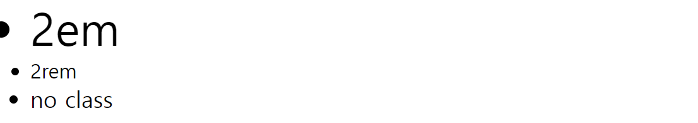
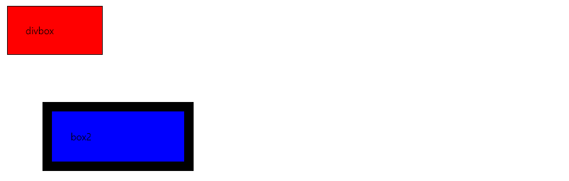
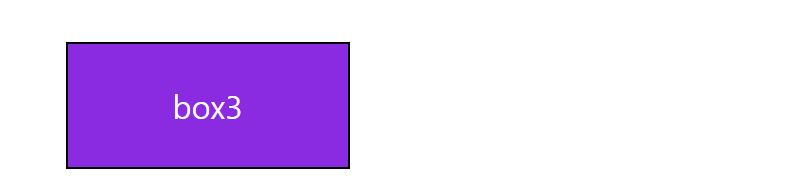
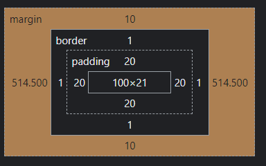

# WEB02 

CSS 기본 스타일 

**크기 단위** 

- em
  - (바로 위, 부모 요소에 대한) 상속의 영향을 받음 
  - 배수 단위 요소에 지정된 사이즈에 상대적인 사이즈를 가짐
- rem
  - (바로 위, 부모 요소에 대한) 상속의 영향을 받지 않음
  - 최상위 요소의 사이즈를 기준으로 배수 단위를 가짐  

- viewport (존재한다 정도만 기억)
  - 웹페이지를 방문한 유져에세 바로 보이게 되는 웹 컨텐츠의 영역 
  - 디바이스의 viewport 기준으로 상대적인 사이즈가 결정 됨

```html
<style>
	.font-big {
      font-size: 36px;
    }

    .em{
      font-size: 2em;
    }
    .rem{
      font-size: 2rem;
    }
</style>


<ul class="font-big">
    <li class="em">2em</li>
    <li class="rem">2rem</li>
    <li>no class</li>
</ul>
```



**색상 단위** 

- 색상 키워드 

  - 대소문자를 구분하지 않음 
  - red, blue, black 과 같은 특정색들은 직접 글자로 나타냄 

- RGB 색상

  - 16진수 표기법 혹은 함수형 표기법을 사용해서 특정색을 표현하는 방식 

- HSL 색상 

  - 색상, 채도, 명도를 통해 특정 색을 표현하는 방식 

  

**CSS Selector**

- 기본 선택자 

  - 전체 선택자, 요소 선택자

  - 클래스 선택자, 아이디 선택자, 속성 선택자

    ```html
    *       -> 전체 선택자 
    x       -> 요소 선택자 (이름에 상관없이 지정 가능)
    .class  -> 클래스 선택자
    #id     -> 아이디 선택자
    X[title]-> 속성 선택자 특정한 속성이 있는 태그만 선택
    ```

    

**CSS 적용 우선순위** 

- **중요도(!importance) : 사용시 주의**
- 우선순위 
  - 인라인 > id > class, 속성, pseudo-class > 요소 , pseudo-element


**CSS 원칙** 1

모든 요소는 네모 박스이고  위에서 아래로, 왼쪽에서 오른쪽으로 쌓인다.

- box model
  - 모든 html 요소는 box 형태로 되어 있음 
  - 하나의 박스는 네 부분의 영역으로 이루어짐 
    - margin : 테두리의 바깥의 외부 여백, 배경색을 지정할수 있다.
    - boeder : 테두리 영역
    - padding : 테두리 안쪽의 내부 여백 요소에 적용된 배경색, 이미지는 padding가지 적용
    - content : 글이나 이미지 등 요소의 실제 내용  


```html
<style>
    .box{
      margin : 20px;
      padding: 30px;
      background-color: red;
      border: 1px solid black;
    }
    .box2{
      margin : 5rem;
      padding : 2rem;
      background-color: blue;
      border: 1rem solid black ;
    }
</style>
<body>
  <div class="box">divbox</div>
  <div class="box2">box2</div>
</body>
```





- box sizing

  - 기본적으로 모든 요소의 box-sizing 은 content-box
    - padding  을 제외한 순수 contents 영역만을 box 로 지정 (padding의 너비는 포함이 안된다)

  - 다만 우리가 일반적으로 영역으로 볼때 border 까지의 너비를 100px으로 보는것으로 인식

    ```html
    <style>
    .box3{
          width: 100px;
          margin: 10px auto;
          padding: 20px;
          border : 1px solid black;
          background-color: blueviolet;
          color: white;
          text-align: center;
        }
    </style>
    
    <body>
      <div class="box3">box3</div>
    </body>
    ```

    

    

    

    - 이러한 경우에는 padding, border 너비까지 고려해야함.(content 너비 + 경계선+ padding 너비 )

      

      

**CSS 원칙** 2

**block / inline**

- block
  - 줄바꿈일 일어나는 요소 
  - 화면크기의 전체으 가로 폭을 차지한다.
  - 블록 레벨 요소 안에 인라인 레벨 요소가 들어 갈 수 있음 
  - 대표적인 블록 레벨 요소 div / ul, ol, li / p / hr / form 등

- inline 
  - 줄 바꿈이 일어나지 않는 행의 일부 요소 
  - content 너비만큼 가로폭을 차지한다 
  - 상하 여백은 line- height 로 지정한다 
  - width, height, margin-top, margin-bottom 을 지정할 수 없다.
  - 대표적인 인라인 레벨 요소 span / a / img / input, label / b, em, i, strong 등


