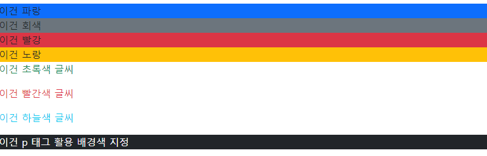
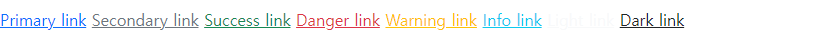
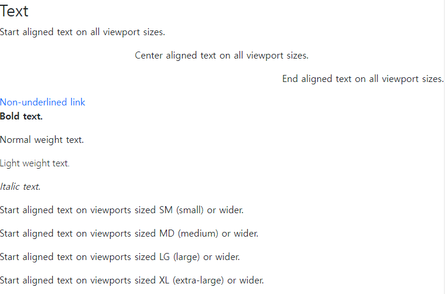
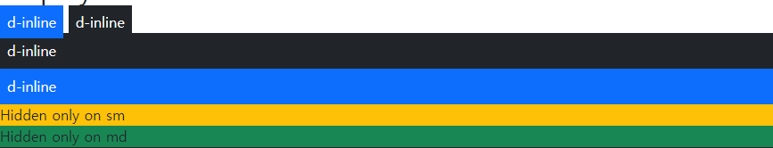

# Bootstrap

**부트스트랩**

- 프론트엔드 개발을 빠르고 쉽게 할 수 있는 프레임 워크 
- HTML과 CSS 기반의 템플릿 양식, 버튼,  네비게이션 및 기타 페이지를 구성하는 요소 포함
  -  각종 레이아웃 입력 창 버튼 등의 디자인을 만들어 놓은것

- 스타터 템플릿

  - 최신 디자인 및 개발 표준을 준하고 있는지 확인 -> 중요한 전역 크타일과 설정 사용해야 함

  - HTML5 doctype과 적절한 반응형 동작을 위해 뷰포트 메타 태그를 사용

    ```html
    <!doctype html>
    <html lang="en">
        <head>
        	<meta name="viewport" content="width=device-width, initial-scale=1">
        </head>
      ...
    </html>
    ```

    -> 모든 장치에서 올바른 렌더일 및 확재 조절을 보장하려면 반응형 viewport 메타 태그 추가

- jsDelivr를 통한 CDN
  - CDN : 컨텐츠(CSS, JS, Image, Text 등)을 효율적으로 전달하기 위해 여러 노드에 가진 네트워크에 데이터를 제공하는 시스템
  - 다운로드 하지 않고 Bootstrap의 컴파일된 css를 프로젝트에 전달 


**Color**

모든 색상의 자식 집합을 사용하여 색 구성표를 만들기 위한 더 작은 색삿

```html
  <h2>Color</h2>
  <div class="bg-primary">이건 파랑</div>
  <div class="bg-secondary">이건 회색</div>
  <div class="bg-danger">이건 빨강</div>
  <div class="bg-warning">이건 노랑</div>
  <p class="text-success">이건 초록색 글씨</p>
  <p class="text-danger">이건 빨간색 글씨</p>
  <p class="text-info">이건 하늘색 글씨</p>
  <p class="text-bg-dark">이건 p 태그 활용 배경색 지정</p>

	<a href="#" class="link-primary">Primary link</a>
	<a href="#" class="link-secondary">Secondary link</a>
	<a href="#" class="link-success">Success link</a>
	<a href="#" class="link-danger">Danger link</a>
	<a href="#" class="link-warning">Warning link</a>
	<a href="#" class="link-info">Info link</a>
	<a href="#" class="link-light">Light link</a>
	<a href="#" class="link-dark">Dark link</a>
```





**Text**

```html
<h2>Text</h2>
  <p class="text-start">Start aligned text on all viewport sizes.</p>
  <p class="text-center">Center aligned text on all viewport sizes.</p>
  <p class="text-end">End aligned text on all viewport sizes.</p>

  <a href="#" class="text-decoration-none">Non-underlined link</a>
  <p class="fw-bold">Bold text.</p>
  <p class="fw-normal">Normal weight text.</p>
  <p class="fw-light">Light weight text.</p>
  <p class="fst-italic">Italic text.</p>

  <p class="text-sm-start">Start aligned text on viewports sized SM (small) or wider.</p>
  <p class="text-md-start">Start aligned text on viewports sized MD (medium) or wider.</p>
  <p class="text-lg-start">Start aligned text on viewports sized LG (large) or wider.</p>
  <p class="text-xl-start">Start aligned text on viewports sized XL (extra-large) or wider.</p>
```



**Display**

디스플레이 유틸리티를 사용하여 컴포넌트의 표시 여부 등을 빠르고 신속하게 전환 가능

```html
  <h2>Display</h2>
  <div class="d-inline p-2 bg-primary text-white">d-inline</div>
  <div class="d-inline p-2 bg-dark text-white">d-inline</div>
  <div class="d-block p-2 bg-dark text-white">d-inline</div>
  <div class="d-block p-2 bg-primary text-white">d-inline</div>
  <div class="box bg-warning d-sm-none d-md-block">Hidden only on sm</div>
  <div class="box bg-success d-md-none d-xl-block">Hidden only on md</div>
  <div class="d-block p-2 bg-danger d-none">Hidden on all</div>

```



