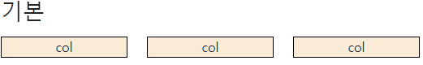
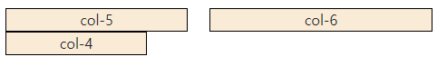
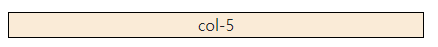
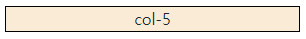
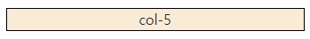
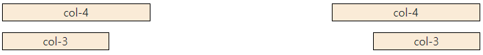
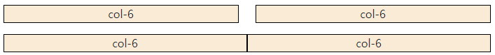

# WEB07 

**Grid system** 

- 요소들의 디자인과 배치에 도움을 주는 시스템 
- 기본요소 
  - Column : 실제 컨텐츠를 포함하는 부분
  - Gutter : 칼럼과 칼럼 사이의 공간
  - Container : Column 들을 담고 있는 공간
- Bootstrap Grid system 은 flexbox로 제작됨
- container, rows, column 으로 컨텐츠를 배치하고 정렬
- 반드시 기억!
  - 12개의 column
  - 6개의 grid breakpoints

```html
 <h2>기본</h2>
    <div class="row my-3">
      <div class="col"><div class="box">col</div></div>
      <div class="col"><div class="box">col</div></div>
      <div class="col"><div class="box">col</div></div>
    </div>
```



- 12 개의 컬럼 중에서 2개를 사용하는 것과 6개를 사용하는 경우

  ```html
  <div class="row my-3">
        <div class="col-2"><div class="box">col-2</div></div>
        <div class="col-6"><div class="box">col-6</div></div>
  </div>
  ```

  


- 12개의 컬럼 수를 넘어서 컬럼을 지정하고 사용하는 경우

  ```html
  <div class="row my-3">
        <div class="col-5"><div class="box">col-5</div></div>
        <div class="col-6"><div class="box">col-6</div></div>
        <div class="col-4"><div class="box">col-4</div></div>
      </div>
  ```

  

-> 지정수의 합이 12개보다 크게 되면  다음줄로 넘어간다


**Grid system breakpoints** 

```html
<div class="row my-3">
      <div class="col-12 col-sm-8 col-md-6 col-lg-4"><div class="box">col-5</div></div></div>
```

화면의 크기에 따라 차지하는 column의 수가 달라짐

- lg-4

   

- md-6



- sm-8




**offset**

```html
<div class="row my-3">
      <div class="col-4">
        <div class="box">col-4</div>
      </div>
      <div class="col-4 offset-4">
        <div class="box">col-4</div>
      </div>
    </div>
    <div class="row my-3">
      <div class="col-3">
        <div class="box">col-3</div>
      </div>
      <div class="col-3 offset-6">
        <div class="box">col-3</div>
      </div>
 </div>
```



**gutter VS no-gutter**

```html
<div class="row my-3">
      <div class="col-6"><div class="box">col-6</div></div>
      <div class="col-6"><div class="box">col-6</div></div>
    </div>
    <div class="row g-0 my-3">
      <div class="col-6"><div class="box">col-6</div></div>
      <div class="col-6"><div class="box">col-6</div></div>
 </div>
```

