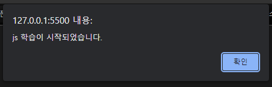
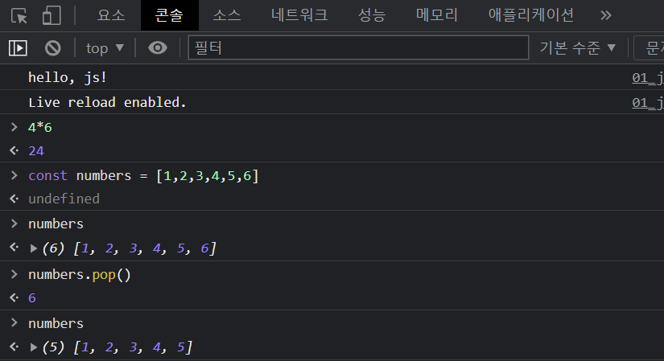
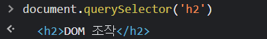
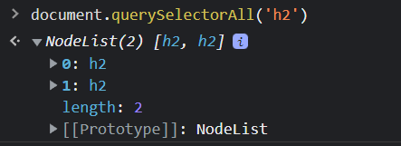
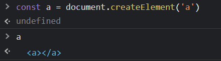
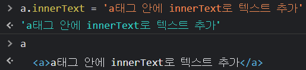
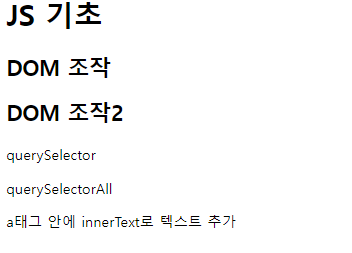

# JavaScript-01

**JavaScript**

- 브라우저 화면을 동적으로 만들기 위함 

- 브라우저를 조작할수 있는 유일한 언어 

  

 **DOM**

- 문서(HTML) 조작
- HTML,XML 과 같은 문서를 다루기 위한 문서 프로그래밍 인터페이스
- 문서를 구조화, 구조화된 구성 요소를 하나의 객체로 취급하여 다루는 논리적 트리모델 
- 단순한 속성 접근, 메서드 활용 뿐 아니라 프로그래밍 언어적 특성을 활용한 조작 가능
- parsing : 구문 해석, 브라우저가 문자열을 해석하여 DOM tree로 만드는 과정


**DOM 조작** 

- html 문서를 만들고 `<scrip>` 영역을 생성  

```html
<script>
    console.log('hello, js!')
    alert('js 학습이 시작되었습니다.') 
  </script>
```




- 개발자 도구 콘솔 창에서도 활용이 가능하다.

  




**DOM 선택 관련 메서드**

- document : DOM 트리의 최상위 객체 
- document.querySelector(selector)
  - 제공한 선택자와 일치하는 element 하나 선택
  - 제공한 CSS selector를 만족하는 첫 번째 element 객체를 반환 (없다면 null)
- document.querySelectorAll(selector)
  - 제공한 선택자와 일치하는 여러 element를 선택
  - 매칭 할 하나 이상의 셀렉터를 포함하는 유효한 CSS selector를 인자(문자열)로 받음
  - 지정된 셀렉터에 일치하는 NodeList를 반환
- 예시

```html
<body>
  <h1 id="title">JS 기초</h1>
  <h2>DOM 조작</h2>
  <h2>DOM 조작2</h2>
  <p class="text">querySelector</p>
  <span class="text">querySelectorAll</span>
    
   <script>
        // 선택자를 활용해 선택할 때 
        // 하나를 선택한다. => querySelector
        // 모든 결과를 선택한다. => querySelectorAll

        console.log(document.querySelector('#title'))
        // <h1 id="title">JS 기초</h1>
        console.log(document.querySelectorAll('h2'))
        // NodeList(2) [p.text, p.text]
  	</script>
</body>
```







- document.getElementById(id)
  - 주어진 문자열과 일치하는 id 속성을 가진 요소를 팢고, 이를 나타내는 Element 반환
- document.getElementsByTagName(name)
  - 엘리먼트의 HTML Collection 과 주어진 태그명을 반환

- document.getElementsByClassName(names)
  - 주어진 클래스를 가진 모든 자식 엘리먼트의 실시간 HTML Collection 을 반환합니다.

- console.log() :  웹 콘솔에 메시지를 출력
  - console.log 와 console.dir() 의 차이 
    - `console.log`는 요소를 HTML과 같은 트리 구조로 출력
    - `console.dir`은 요소를 JSON과 같은 트리 구조로 출력


**DOM 변경 관련 메서드**

생성

- document.createElement()

  - 작성한 태그 명의 HTML 요소를 생성하여 반환

- Node.innerText

  - Node 객체와 그 자손의 텍스트 컨텐츠(DOMString)를 표현 (해당 요소 내부의 raw text) (사람이 읽을 수 있는 요소만 남김)
  - 즉, 줄 바꿈을 인식하고 숨겨진 내용을 무시하는 등 최종적으로 스타일링이 적용된 모습으로 표현

- Element.innerHTML

  - 요소(element) 내에 포함된 HTML 마크업을 반환

- Element.append()

  - 특정 부모 Node의 자식 NodeList 중 마지막 자식 다음에 Node 객체나 DOMString을 삽입
  - 여러 개의 Node 객체, DOMString을 추가 할 수 있음
  - 반환 값이 없음

- Node.appendChild()

  - 한 Node를 특정 부모 Node의 자식 NodeList 중 마지막 자식으로 삽입 (Node만 추가 가능)
  - 한번에 오직 하나의 Node만 추가할 수 있음
  - 만약 주어진 Node가 이미 문서에 존재하는 다른 Node를 참조한다면 새로운 위치로 이동

  

  

  - 작성한 태그 명의 HTML 요소를 생성하여 반환

  

  - 생성한 태그에 텍스트 삽입

    

  - body 태그에 생성한 a태그 삽입

    

    

    

**DOM 변경 관련 메서드**

- Element.setAttribute(name, value)
  - 지정된 요소의 값을 설정
  - 속성이 이미 존재하면 값을 갱신, 존재하지 않으면 지정된 이름과 값으로 새 속성을 추가
- Element.getAttribute(attributeName)
  - 해당 요소의 지정된 값(문자열)을 반환
  - 인자(attributeName)는 값을 얻고자 하는 속성의 이름