# Django 01 - Django 개발 환경 설정 가이드

**Django**

- 파이썬으로 만들어진 무료 오픈소스 웹 애플리케이션 프레임 워크 
- 프레임워크 - 어플리케이션 개발을 위해 필요한 기본적인 클래스와 라이브러리 등이 포함된 환경 및 기본 개념 구조 
  - 기본적인 도구가 제공된 환경에서 어플리케이션을 만들수 있다.
  - 자주 사용되는, 비슷한 기능을 빠르고 쉽게 구현 할수 있는 환경 제공
    - 유지보수 용이 
    - 재사용성 
    - 생산성이 높음
    - 통일성 보장 

- 웹 개발에 있어 번거로운 요소들을 새오 개발할 필요 없이 내장된 기능을 사용해 빠른 개발 가능 
- MTV 패턴 : django 의 디자인 패턴 
  - Model : 데이터베이스에 저장되는 데이터, CRUD 하는 부분 
  - Template :  사용자에게 보여지는 UI 부분
  - View : 프로그램의 로직을 구현하여 데이터 요청후 가져온 데이터를 Template에 전달
  -  URLConf(URL 설계) :  URL 패턴을 정의하여 URL 과 뷰를 매핑하는 단계 


**가상환경 생성 / 실행**

- 가상환경 생성/ 실행하는 이유 : 독립적인 작업환경에서 작업이 가능하다.

  - 프로젝트를 진행하다보면 여러가지 라이브러리와 패키지들로 인해 의존성에 문제 발생 -> 충돌이 발생 할 수 있음.
  - 독립적인 작업환경을 구성 할 수 있는 `venv` 환경을 사용

- 가상환경 생성 

  ```bash
  $ python -m venv myvenv
  ```

  - 사용자가 원하는 폴더에서 GIT bash 를 통해 사용 할 수 있는가상환경을 생성할수 있다. (상대적인 위치 중요)

  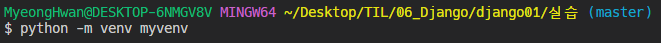

  

  - 가상환경 생성 완료. 아직 실행되지 않은 상태. 

  

  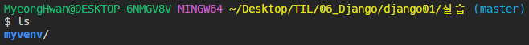

  

  - 가상환경을 실행 유지하기 위한 설정 파일들이 내장

    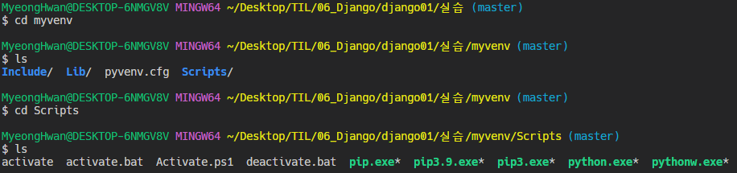

- 가상환경 실행

  ```bash
  $ source myvenv/Scripts/activate
  ```

  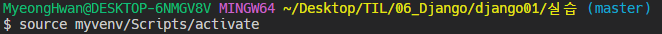

​	

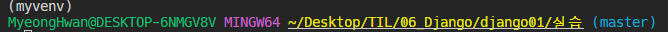

**Django LTS 설치**

- Django LTS(Long Term Support)설치

  - LTS : 오래 유지되고 보완했던 버전 설치 -> 최신 버전은 아직 오류가 발생할 가능성이 있음.

  - 가상환경에 설치한 경우 외부 환경과는 별개로 다른 버전을 설치 할수 있다.
  - 외부환경에도 설치되는것은 아니다. (가상환경에서만.)

  ```bash
  $ pip install django==[버전(3.x.xx)]
  ```

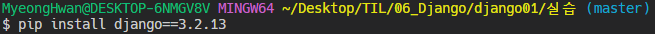

**Django 프로젝트 생성**

- Django 프로젝트 생성 

  ```bash
  $ django-admin startproject [프로젝트 이름][시작경로]
  ```

  - 시작경로에 `.` 을 찍으면 현재 디렉터리를 의미한다.
  - 프로젝트가 생성되면 django가 필요로하는 여러가지 디렉터리 파일들이 생성 

  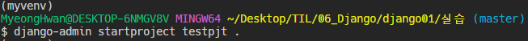

  - 생성 확인

​                                        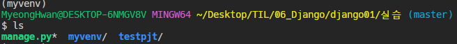

**Django 실행**

- 프로젝트 생성 후 구동

  - 구동 후 localhost:8000 에서 확인 가능 

  ```bash
  $ python manage.py runserver
  ```

  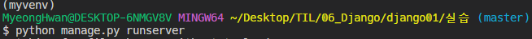

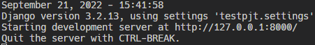

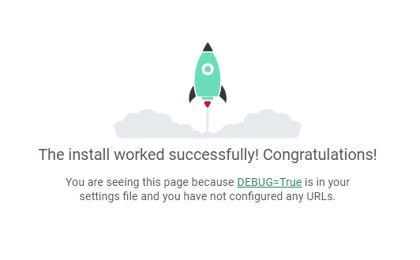