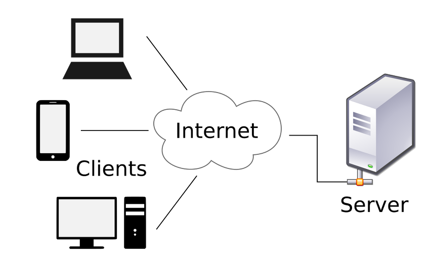
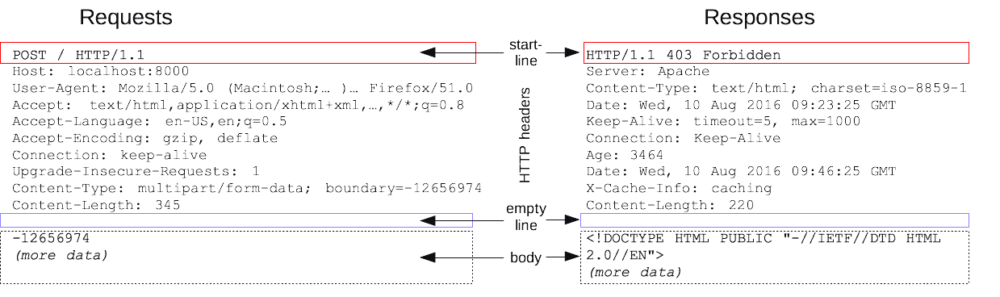

# 서버 기초 내용 정리

**Q. IP와 도메인은 무엇일까요?**

`Client` : 서버에서 사용할 수 있는 서비스에 접근하는 컴퓨터 하드웨어 또는 소프트웨어

`Server` : 다른 컴퓨터의 request(요청) 를 위해 서비스를 실행하는 물리적인 컴퓨터 또는 실행중인 서버

`Host` : 네크워크를 이용하기 위해 네트워크에 연결된 컴퓨터 혹은 그 외의 장치 

-> 네트워크 상에서 요청하는 호스트는 **Client** 

-> 요청에 응답할수 있는 호스트는 **Server**

 이러한 각각의 호스트들이 서로 데이터를 주고 받기 위해 자신들을 구분하는 특수한 번호를 **IP주소** 라고 한다.

**Q. IP와 도메인은 무엇일까요?**

- **IP주소** 
  - **I**nternet **P**rotocol Address
  - 인터넷 프로토콜을 사용하는 네트워크에 연결된 모든 장치에 할당된 번호다.
  - protocol : 상호간의 약속한 규칙 - 통신 규약
  - `4개의 숫자`와 `.` 으로 구성 됨 
    - 127.0.0.1 각각의 숫자는 0~255의 정수 

- **도메인** 
  - 웹 브라우저의 주소 입력창에 https://www.naver.com/ 입력하는 주소 
  - 웹브라우저는 이해할수 없는 인간이 구분할수 있는 문자열 
  - `naver.com`을 **도메인**이라고 한다.
  - 우리가 웹브라우저가 이해하지 못하는 문자열로 해당 페이지로 이동할 수 있는 것은 **DNS(도메인네임시스템)** 때문이다. 

**Q. 정적 웹 사이트와 동적 웹 사이트의 차이점은 무엇일까요? **

- **정적 웹사이트** 

  - 서버에 미리 저장된 파일이 그대로 전달되는 웹사이트
  - 사용자는 거버에 저장된 데이터가 변하지 않는한 고정된 웹사이트를 제공받음
  - 모든 사용자들은 같은 결과의 웹사이트를 서버에 요청하고 응답 받음 
  - EX) 회사소개 페이지, 구성원 소개 등등

- **정적 웹사이트 장, 단점**

  - 장점
    - 요청에 의한 파일만 전송하면 되기때문에 서버간 통신이 거의 없고 속도가 빠름
    - 단순한 문서들로만 구성되어 있어 구축하는데 비용이 적게 든다 

  - 단점
    - 저장된 정보만 제고하기 때문에 서비스가 단순함
    - 추가 수정 삭제 등의 작업을 직접 다운받아 편집후 업로드 하는 과정에서 관리가 힘들다. 

  

- **동적 웹사이트**

  - 요청 정보를 처리한 후 제작된 HTML 문서를 클라이언트에게 전송하는 웹사이트
  - 사용자는 상황, 시간, 요청 등에 따라 달라지는 웹페이지를 볼수 있다.
  - 같은 페이지더라도 사용자마다 다른결과의 웹페이지를 서버에 요청하고 받을 수 있다.
  - Ex) 네이버, 직방, 등등

- **동적 웹사이트 장, 단점**

  - 장점
    - 다양한 정보를 조합해 웹페이지를 제공하기 때문에 서비스가 다양하다
    - 웹사이트 구조 에 따라 추가, 수정, 삭제를 사용자 측에서 가능하기때문에 관리가 쉽다

  - 단점
    - 사용자에게 웹 페이지를 전달하기 위해 처리하는작업이 필요하기 때문에 상대적으로 느리다 
    - 웹 서버외에 추가적으로 처리를 위한 어플리케이션 서버가 필요하기 때문에 추가적이 비용 고려

  

**Q. Django는 무엇을 위한 도구인가요?**

- **Django**
  - 보안이 우수하고 유지보수가 편리한 웹사이트를 신속하게 개발하는 하도록 도움을 주는 파이썬 웹 프레임워크
  - 다양한 기능을 웹 애플리케이션 프레임워크라고 하는 재사용 가능한 모듈의 대규모 컬렉션으로 그룹화하여 작업을 더 쉽게 수행할 수 있도록 한다.
  - 여러 프레임워크들 중에서 python 언어로 작성되어 있다.
  - 설치와 학습이 간단하고 매우 쉬워서 접근이 쉽다.
  - 웹 개발에 즉시 사용가능한 기능의 구조를 제공한다.

**Q. HTTP는 무엇이고 요청과 응답 메시지 구성은 어떻게 되나요?**

- **HTTP**
  - 문서와 같은 리소스들을 가져올 수 있도록 해주는 프로토콜
  - 웹에서 이루어지는 모든 데이터 교환의 기초이며, 클라이언트-서버 프로토콜

- **HTTP  메시지**
  - HTTP 메시지는 서버와 클라이언트 간에 데이터가 교환되는 방식
  - 메시지 타입은 두 가지
    - 요청(*request)은* 클라이언트가 서버로 전달해서 서버의 액션이 일어나게끔 하는 메시지고, 응답(*response)은 요청*에 대한 서버의 답변
  - HTTP 메시지는 ASCII로 인코딩된 텍스트 정보이며 여러 줄
  - HTTP 요청과 응답의 구조는 서로 닮았다.

start line

- **start line**에는 **요청이나 응답의 상태**를 나타낸다.
- **항상 첫 번째 줄**에 위치한다.
- **응답에서는 status line**이라고 부른다.

HTTP headers

- **요청을 지정**하거나, 메시지에 포함된 **본문을 설명하는 헤더의 집합**이다.

empty line

- **헤더와 본문을 구분하는 빈 줄**이 있다. 그 줄을 말한다.

body

- **요청과 관련**된 데이터나 **응답과 관련**된 **데이터 또는 문서를 포함**한다.
- **요청과 응답의 유형**에 따라 **선택적으로 사용**한다.

**Q. 프레임워크는 무엇일까요?**

- **프레임 워크**
  - 프레임워크란, 소프트웨어의 구체적인 부분에 해당하는 설계와 구현을 재사용이 가능하게끔 일련의 협업화된 형태로 클래스들을 제공하는 것
  - 특정 개념들의 추상화를 제공하는 여러 클래스나 컴포넌트로 구성.
  - 추상적인 개념들이 문제를 해결하기 위해 같이 작업하는 방법을 정의
  - 컴포넌트들은 재사용이 가능
  -  높은 수준에서 패턴들을 조작화