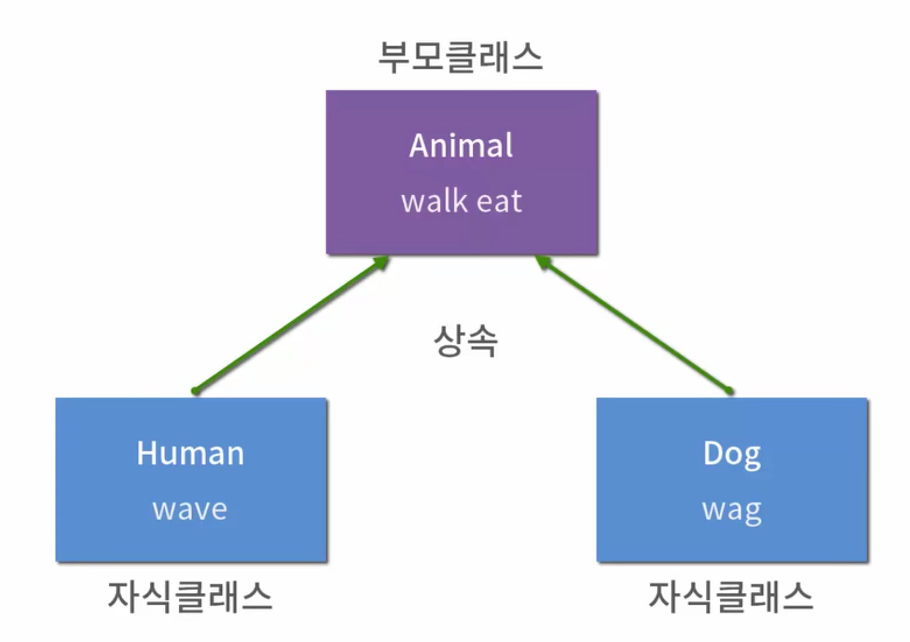

# python 객체지향 프로그래밍 - 2
## 클래스 


클래스 속성 

 - 한 클래스의 모든 인스턴스라도 똑같은 값을 가지고 있는 속성 
 - 클래스 선언 내부에서 정의 
 - classname.name 으로 접근 할당 


인스턴스와 클래스 간의 이름 공간 

- 클래스를 정의 하면 크래스와 해당하는 이름 공간 생성 
- 인스턴스를 만들면 인스턴스 객체가 생성 되고 이름 공간 생성 
- 인스턴스에서 특정 속성에 접슨하면, 인스턴스 -> 클래스 순으로 접근


클래스 메소드 

- 클래스가 사용할 메소드
-  호출시, 첫번째 인자로 클래스가 전달됨.


스태틱 메소드

-  인스턴스 변수 , 클래스 변수를 전혀 다루지 않는 메소드
- 언제 사용하는가?
  - 속성을 다루지 않고 단지 기능만을 하는 메소드를 정의 할 때 사용
  - `@staticmethod` 데코레이터를 사용하여 정의 
  - 호출 시, **어떠한 인자도 전달되지 않음** 

```python
class MyClass:
@staticmethod
def class_method(arg1, …):
```

## 객체지향 핵심개념


추상화 

- 예시) 컴퓨터

  - 속성 : ram , ssd , cpu

  - 메서드 : 연결, 실행...

    **이러한 속성과 메서드를 추출해 내는것을 추상화 라고 한다**

상속

- 두 클래스 사이 부모 - 자식 간의 관계를 정립하는 것

- 클래스는 상속이 가능함

   

- 하퀴 클래스는 상위 클래스에 정의된 속성, 행동, 관계및 제약 조건을 모두 상속 받음 

```python
class 부모클래스:
    ...내용...

class 자식클래스(부모클래스):
    ...내용...
    
class Country:
    """Super Class"""

    name = '국가명'
    population = '인구'
    capital = '수도'

    def show(self):
        print('국가 클래스의 메소드입니다.')


class Korea(Country):
    """Sub Class"""

    def __init__(self, name):
        self.name = name

    def show_name(self):
        print('국가 이름은 : ', self.name)
    
    
    
```


다형성

- 여러모양을 뜻하는 그리스어 
- 동일한 메소드가 클래스에 따라 다르게 행동할 수 있음을 의미 
- 즉, 서로 다른 클래스에 속해 있는 객체들이 **동일한 메시지에 대해 다른 방식으로 응답될 수 있음**

- 메소드  오버라이딩

  ``` python
  class Person:
      def greeting(self):
          print('안녕하세요.')
   
  class Student(Person):
      def greeting(self):
          print('안녕하세요. 저는 파이썬 코딩 도장 학생입니다.')
   
  james = Student()
  james.greeting()
  ```

  

캡슐화

- 객체의 일부 구현 내용에 대해 외부로부터 직접적인 접근을 차단 
- 파이썬에서 기능상으로 존재하지 않지만 관용적으로 사용되는 표현이 있음.
