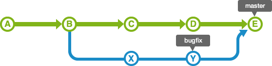

# Branch

## 1. Git Flow

- **Git 을 활용하여 협업하는 흐름으로 branch 를 활용하는 전략을 의미한다.**


## 2. branch

- **'나무가지'란 뜻으로, 만들어 놓은 버전(master)의 복사본(branch)을 만들어 다른 방향으로 작업을 이어나가는 것. **
  - 즉, 브랜치를 통해 하나의 프로젝트를 여러 갈래로 나누어서 관리 할 수 있다. 각각의 독립된 branch에서 마음대로 코드를 변경하여 작업한 후에 원래 버전과 비교하여 또 하나의 새로운 버전을 만들어 낼수 있다.


## 3. branch 기본 명령어

- `git branch [-l or --list]` : 로컬에 존재하는 브랜치를 리스트로 보여준다. 

```bash
$ git branch -l or --list
* master
```

- `git branch -v` : 로컬 브랜치의 정보를 마지막 커밋 내역과 함께 보여준다.

```bash
$ git branch -v
* master a393617 create example
```

- `git branch branchname` :  로컬에 새로운 브랜치를 생성하는 명령어이다.

``` bash
$ git branch example

$ git branch -l
  example
* master
```

- `git checkout branchname` :  로컬에 있는 해당 브랜치로 이동하는 명령어이다.

``` bash
$ git checkout example
Switched to branch 'example'

MyeongHwan@DESKTOP-6NMGV8V MINGW64 ~/Desktop/BranchTest (example)
$ 
```

- `git branch -d branchname` : 해당브랜치를 삭제하는 명령어이다.

``` bash
$ git branch -d example
Deleted branch example (was a393617).
```


## 4. branch merge

- **각 브랜치에서 작업을 한 이후 이력을 합치기 위해 일반적으로 `merge`명령어를 사용한다.**

  - 병합을 진행할때 만약 서로 다른 이력이 있다면 충돌이 발생할 수도 있다.

    -> 이러한 경우에는 반드시 직접 수정을 진행해야한다.


- Branch merge `fast -forward`


그림과 같이 `master` 브랜치에서 분기하는`bugfix` 라는 브랜치가 생성이 됐다.`master`는 `bugfix`의 내용을 포함하고 있으므로 단순히 이동만으로도 병합을 쉽게 할수 있다.


- Branch merge  `merge commit`


기존 `master`브랜치에도변경사항이 생겨 병합 커밋이 발생한다. `master`는 `bugfix`의 내용을 포함하고 있지 않아서 므로 단순히 이동만으로도 병합을 쉽게 할수 없다.

이 경우에는 `master` 브랜치 내의 변경 내용과 `bugfix` 브랜치 내의 변경 내용을 하나로 통합할 필요가 있다.




1. master 이자 branch인 경우. 
2. 서로 다른 파일의 커밋을 merge 하는 경우 -> 반드시 master 가서 커밋한 이후에 머지 해야함 
3. 같은 파일의 수정이 있는 경우=> 브랜치 충돌 병합 과정에서 원하는 방향에 맞게 수정해야함 

