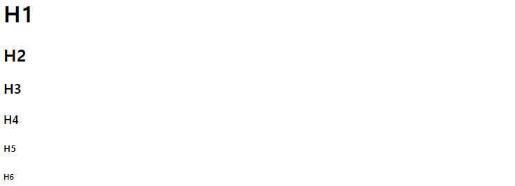
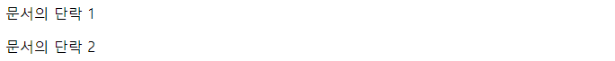
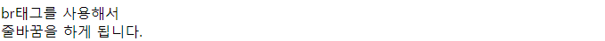
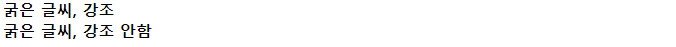
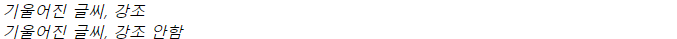
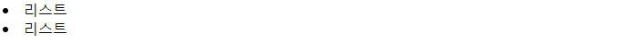
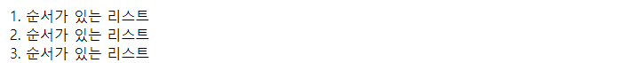
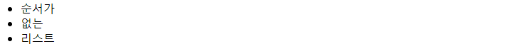
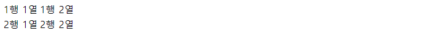

# WEB 01

### 웹 사이트의 구성 요소


**HTML**

웹에서 보이는 글, 문서, 그림 등 정보를 주는 콘텐츠와 그 콘텐츠의 위치 지정

태그 등을 이용하여 문서나 데이터의 `구조` 를 담당하는 언어

**CSS**

스타일 시트 언어, HTML 요소의 스타일을 선택적으로 지정하는데 사용

HTML 이나 XML 같은 마크업 언어로 쓰인 문서를 화면에 어떻게 보여지는지 정의하기 위한 언어 

**JavaScript**

웹에서의 동적인 요소를 구현하는 객체 기반의 스크립트 언어 


### HTML (Hyper Test Markup language )기초

### 기본 구조 태그

`<!DOCTYPE html> `: 웹문서의 유형을 HTML 로 지정

```html
<!DOCTYPE html>
```


`<html> </html>`  : 웹페이지의 시작과 끝, 모든 태그를 감싸는 가장 큰 단위의 태그

```html
<!DOCTYPE html>
<html>
    
</html>
```


`<head> </head>` : 브라우저의 정보를 입력하는곳 html 문서에 대한 메타 데이터를 넣을수 있고 `<style>`이나 `<script>` 도 삽입

```html
<!DOCTYPE html>
<html>
<head>

</head>    
</html>
```


`<title> </title>` : 문서 제목을 의미하는 태그 

```html
<!DOCTYPE html>
<html>
<head>
	<title>
    이것은 제목입니다.
    </title>
</head>    
</html>
```


`<meta> </meta>` : 메타데이터 입력, 주로 `<meta charset = "UTF-8">`  처럽 입력

charset : 문서가 어떤 문자로 되어 있는지 

viewpoint : 어떤 기기를 기준으로 하는지 

description : 웹페이지에 대한 설명 

og : 웹페이지에 대한 소셜 이미지

keyword : 웹페이지에 대한 키워드 

```html
<!DOCTYPE html>
<html>
<head>
    <meta charset = "UTF-8">
	<title>
    문서의 제목입니다.
    </title>
</head>    
</html>
```


`<body> </body>` : 콘텐츠가 들어가는 영역을 의미하는 태그 

```html
<!DOCTYPE html>
<html>
<head>

</head>    
<body>
 문서의 콘텐츠 영역입니다.
</body>
</html>
```


### 문서 내용입력 태그

**텍스트**

`<h1>,<h2>...` : 제목, 글자 크기 최근에는 중요도 우선순으로 많이 사용

```html
    <h1>H1</h1>
    <h2>H2</h2>
    <h3>H3</h3>
    <h4>H4</h4>
    <h5>H5</h5>
    <h6>H6</h6>
```





`<p></p>` : 문서의 단락을 나눌때 사용, 내용이 길면 웹브라우저 창의 너비에 맞게 줄바꿈

```html
<p>문서의 단락 1</p>
<p>문서의 단락 2</p
```

 


`<br>` : 줄바꿈

```html
br태그를 사용해서 <br>줄바꿈을 하게 됩니다.<br>
```




`<strong>`: 굵게 표시. 화면 낭독기에서 강조해서 읽음

`<b>` :  굵게 표시. 중요하지 않음

```html
<strong> 굵은 글씨, 강조 </strong><br>
<b> 굵은 글씨, 강조 안함 </b><br>
```




`<em>` : 중요한 텍스트를 기울여 표시(문장). 화면 낭독기에서 강조해서 읽음

`<i>` : 기울여 표시. 중요하지 않음

```html
<em>기울어진 글씨, 강조</em><br>
<i>기울어진 글씨, 강조 안함</i><br>
```



**목록**

`<li>` : 목록의 각 항목을 생성, 나타냄

```html
<li>리스트</li>
<li>리스트</li>
```




`<ol>` : 순서가 있는 목록의 시작과 끝을 나타냄

type = " " -> 순서의 차례로 숫자 알파벳 등을 설정 할수 있음. 

start = " 3 " -> 순서 3부터 시작

```html
<ol>
    <li>순서가 있는 리스트</li>
    <li>순서가 있는 리스트</li>
    <li>순서가 있는 리스트</li>
</ol>

<ol type = "A">  
</ol>
```




`<ul>` : 순서가 없는 목록의 시작과 끝을 나타냄 

```html
<ul>
    <li>순서가 있는 리스트</li>
    <li>순서가 있는 리스트</li>
    <li>순서가 있는 리스트</li>
</ul>
```



`<table></table>` : 테이블 생성 

`<tr></tr>` : 행 삽입

`<td></td>` : 셀 삽입 

```html
<table>
      <tr>
        <td>1행 1열</td>
        <td>1행 2열</td>
      </tr>
      <tr>
        <td>2행 1열</td>
        <td>2행 2열</td>
      </tr>
    </table>
```



**이미지**

`` : 이미지 삽입

src = : 이미지 파일 경로 

alt = : 대체용 텍스트 

width = : 가로 크기 조절 

height = : 세로크기 조절 

% -> 브라우저 창의 크기 단위 

px -> 픽셀 단위  

```html

```

**하이퍼 링크 ** 

`<a></a>` : 하이터 링크 삽입, 이미지 링크로도 가능

herf = : 링크 주소 

target = "_blank" : 새탭에서 열기 

```html
<a href="링크할 주소">텍스트 또는 이미지</a>

</a></a>
```


### CSS 기초

**기본 문법**

셀렉터{프로퍼티 : 값;}

```html 
a {color : red; font-size: 12px;}
```

a 셀렉터에 해당하는 부분의 글자의 사이즈를 12px 로 지정하고 색상은 빨간색으로 지정한다.

**선택자**

- 요소 선택자 : css 적용할 대상으로 요소 이름을 직접 사용하여 선택할 수 있다.

  ```html
  <style>
     h2 { color: teal; text-decoration: underline; }
  </style>
   
  ...
  <h2>이 부분에 스타일을 적용합니다.</h2>
  ```

  

- 아이디 선택자 : 특정 요소를 선택해 사용할 때 #을 써서 구분하여 사용

  ```html
  <style>
     #heading { color: teal; text-decoration: line-through; }
  </style>
   
  ...
  <h2 id="heading">이 부분에 스타일을 적용합니다.</h2>
  
  ```

  

- class 선택자 : 특정 집단의 여러 요소를 한번에 선택, 같은 클래스 이름을 가지는 요소들을 모두 선택 

  ```html
  <head>
  	<meta charset="UTF-8">
  	<title>CSS Syntax</title>
  	<style>
  		.headings {
  			color: lime;
  			text-decoration: overline;
  		}
          .headings2 { 
              color: blue; 
              font-size: 50px; 
          }
  	</style>
  </head>
   
  <body>
   
  	<h1>클래스 선택자를 이용한 선택</h1>
  	<h2 class="headings">이 부분에 스타일을 적용합니다.</h2>
  	<p>클래스 선택자를 이용하여 스타일을 적용할 HTML 요소들을 한 번에 선택할 수 있습니다.</p>
  	<h3 class="headings">이 부분에도 같은 스타일을 적용합니다.</h3>
  	<h3 class="headings headings2">이 부분에는 다른 스타일과 추가 스타일을 적용합니다.</h3>
   
  </body>
  ```

  

- 전체 선택자 : 요소 내부의 모든 요소 선택

  ```html
  <style>
     * { color: teal; text-decoration: underline; }
  </style>
  ```

  

**선언방식 **

인라인 방식 

- html 요소의 style 속성에 직접 작성하는 방식 

  ```html
  <body>
      <p style = "height:100px; color:blue">
          
      </p>
  </body>
  ```

내장방식 

- html `<style></style>` 안에 작성하는 방식 

  ```html
  <head>
      <style type = "text/css">
          .logo{color : #eeeeee;}
      
      </style>
  </head>
  
  ```

링크방식 

- HTML `<link>`를 이용하여 외부 문서로 CSS를 불러와 적용하는 방식

  ```html
  <head> 
    <link href="style.css" rel="stylesheet" type="text/css"> 
  </head>
  ```

  
