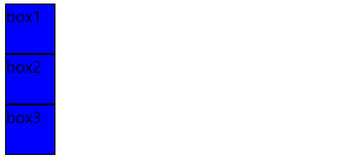
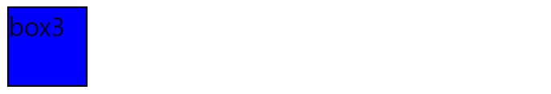

# WEB03

**CSS position**

- 문서 상에서 요소의 위치 지정 
- static : 모든 태그의 기본 값 (기분 위치)
  - 일반적인 요소의 배치 순서에 따름 (좌측 상단)
  - 부모 요소 내에서 배치될 때는 요소의 위치 기준으로 배치 됨 

1. relative : 상대 위치

   - 자기 자신의 static 위치를 기준으로 이동 (normal flow 유지)

   - 레이아웃에서 요소가 차지하는 공간은 static 일때와 같음 (normal position 대비 offset)

     ```html
     <style>
         .box{
           position: relative;
           background-color: blue;
           width: 3rem;
           height: 3rem;
           border: 1px solid black;
         }
     </style>
     <body>
       <div class ="box">box1</div>
       <div class ="box">box2</div>
       <div class ="box">box3</div>
     </body>
     ```

     

2. absolute : 절대 위치

   - 요소를 일반적인 문서 흐름에서 제거 후 레이아웃에 공간을 차지하지 않음(normal flow 벗어남)

   - 다른 요소 위에 존재 할수 있다 -> absolute

     ```html
     <style>
         .box{
           position: absolute;
           background-color: blue;
           width: 3rem;
           height: 3rem;
           border: 1px solid black;
         }
     </style>
     <body>
       <div class ="box">box1</div>
       <div class ="box">box2</div>
       <div class ="box">box3</div>
     </body>
     ```

     

3. fixed : 고정위치

   - 요소를 일반적인 문서 흐름에서 제거 후 레이아웃에 공간을 차지하지 않음(normal flow에서 벗어남)
   - 부모 요소와 관계없이 viewport를 기준으오 이동 
     - 스크롤 시에도 항상 같은 곳에 위치함 

4. sticky : 스크롤에 따라 static -> fixed로 변경 
   -  속성을 적용한 박스는 평소에 문서 안에서 position: static 상태와 같이 일반적인 흐름에 따르지만 스크롤 위치가 임계점에 이르면 position: fixed와 같이 박스를 화면에 고정할 수 있는 속성
   - 일반적으로 Navigation Bar에서 사용됨. 

**CSS 원칙**

- 모든 요소는 네모 박스 모델, 좌측 상단에 배치
- display 에따라 크기와 배치가 달라짐 
- position으로 오치의 기준을 변경 
  - relative : 본인의 원래 위치 
  - absolute : 특정 부모의 위치
  - fixed : 화면의 위치
  - sticky : 기본적으로 static 이나 스크롤에 따라 이동 fixed 로 변경

**CSS Layout**

레이아웃 테크닉 

- Display
- Position
- Float
- Flexbox
- Grid


**Float**

- 박스를 왼쪽 혹은 오른쪽 으로 이동시켜 텍스트를 포함 인라인요소들이 주변을 wrapping 하도록 함

- 요소가 Normal flow 벗어나도록 함 

  

**Flexbox**

- 행과 열 형태로 아이쳄ㅇ르 배치하는 1차원 레이아웃 모델 
- 축 
  - main axis(메인 축)
  - cross axis(교차 축)
- 구성 요소 
  - Flex Container(부모 요소)
    - flexbox 레이아웃을 형성하는 가장 기본적인 모델 
    - Flex Item들이 놓여있는 영역 
    - display 속성을 flex 혹은 inline-flex로 지정
  - Flex Item(자식 요소)
    - 컨테이너에 속해 있는 컨텐츠(박스)