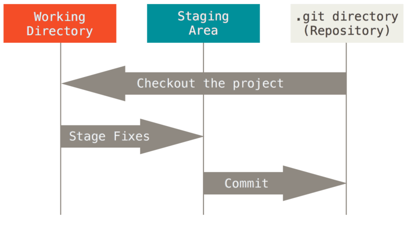

# Git

## Git 이란

- **리눅스 커널을 위한 도구로 2005년 리누스 토르발스가 개발**

- **Git 은 분산버전관리 시스템으로 컴퓨터 파일의 변경사항을 추적하고 관리하는 도구** 

  => 분산 버전 관리란 원격 저장소를 통합하여 협업하고 모든 히스토리를 클라이언트들이 공유하는 시스템

## Git 기본 명령어 

- **디렉토리 주요 명령어**
  - `pwd` : 디렉토리 경로 확인
  - `cd` : 디렉토리 이동
  - `ls` :  디렉토리 내용 확인
  - `mkdir` :  디렉토리 생성 
  - `touch` : 파일 생성
  - `rm` : 파일 삭제

- **git 명령어**

  - `git init` : 로컬에 새로운 레포지토리를 만들 때 사용한다.

  - `git add` : 변경된 파일을 추적(stage)시키는 명령어다.

  - `git commit -m '<message>'` : 커밋으로 추적한 파일 및 폴더의 추가/변경 사항을 저장소에 기록한다. 어떤 기능을 추가했는지 간단한 메세지와 함께 기록할 수 있다.
  - `git status` : Git 저장소에 있는 파일의 상태를 확인 할 수 있다.
  - `git log` : 현 브랜치의 버전 히스토리를 보여준다.

  - `git remote add origin <https://github.com/username/repository.git>` : 로컬저장소와 원격저장소를 연결
  - `git push origin master` : 연결된 원격 저장소로 변경된 파일들과 커밋 내역을 추가한다.

## Git 흐름

- **Working Directory** : 작업(수정)한 파일
- **Staging Area** : 버전으로 기록할 파일을 모으는 '임시공간'
- **Repository** : 버전들이 기록되는 곳