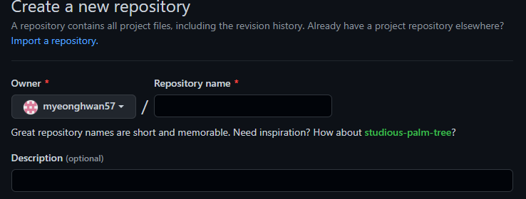
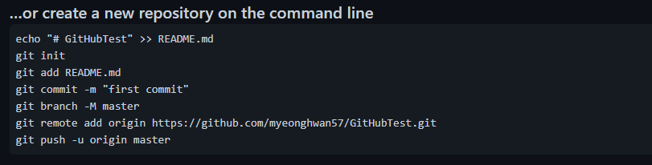
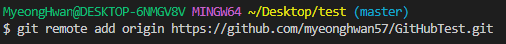
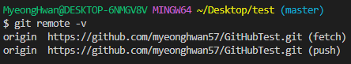
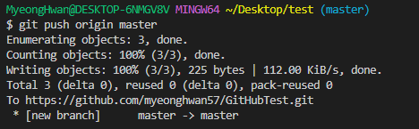

# GitHub

## 1. 원격 저장소 만들기

1. Repository name에 해당하는 저장소 이름 설정
2. Descroption 에 간단한 저장소에 대한 설명

3. git remote add origin https: //github.com/myeonghwan57.GitHubTest.git 

   => 원격저장소 명령문 확인.

   

## 2. 원격 저장소 경로 설정

- 원격 저장소 정보를 로컬 저장소에 추가

- 로컬 저장소에는 한번만 설정 해주면 된다

  

## 3. 원격 저장소 정보 확인

- 원격 저장소의 정보 확인

## 4. 원격 저장소 push

- 원격 저장소로 로컬 저장소 변경 사항(커밋)을 올림(push)

