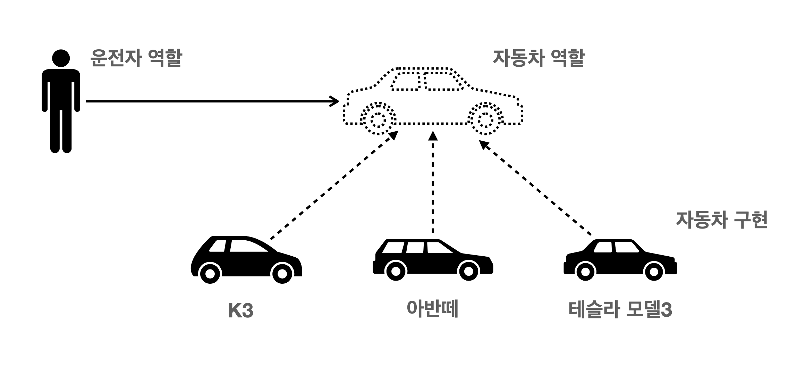

# python - 객체지향 프로그래밍 
## 객체지행 프로그래밍  

객체의 특징 

- type: 어떤 연산자와 조작이 가능한가?
- 속성: 어떤 상태를 가지는가?
- 조작법: 어떤 행위를 할 수 있는가?


객체지향 프로그래밍이란?

- 프로그램을 여러개의 독립된 객체들과 그 객체들 간의 상호작용으로 파악하는 프로그래밍 방법



자동차 : **클래스(class)**

각 자동차 (k3, 아반떼, 테슬라 모델3) : **인스턴스 (instance)** 

자동차의 정보 : **속성(attibute)** 

자동차의 기능 : **메소드(method)**

- 객체 지향의 장점 
  - 프로그램을 유연하고 변경이 용이 
  - 소프트웨어 개발과 보수를 간편하게 하며, 직관적인 코드 분석 가능

## OOP 기초

```python
# 클래스 정의
class MyClass:
pass
# 인스턴스 생성
my_instance = MyClass()
# 메서드 호출
my_instance.my_method()
# 속성
my_instance.my_attribute

```

클래스와 인스턴스 

- 클래스 : 객체들의 분류 

- 인스턴스 : 하나하나의 실체 

  **파이썬은 모든 것이 객체, 모든것이 객체 특정 자입의 인스턴스**

- 속성 : 특정 타입/ 클래스의 객체들이 가지게 될 상태/ 데이터를 의미 
- 메소드 : 특정 데이터 타입 / 클래스의 객체에 공통적으로 적용가능한 행위 (함수)


인스턴스 

- 인스턴스 변수 
  - 인스턴스가 개인적으로 가지고 있는 속성 
  - 각 인스턴스들의 고유한 변수 
- 생성자 메소드에서 `self.<name>` 으로 정의
- 인스턴스가 생성된 이후 `<instance>.<name>` 으로 접근 및 할당
- 인스턴스 메소드
  - 인스턴스 변수를 사용하거나 , 인스턴스 변수에 값을 설정하는 메소드 
  - 클래스 내부에 정의 되는 메소드의 기본 
  - 호출 시, 첫번째 인자로 인스턴스 자기자신(self)이 전달됨
