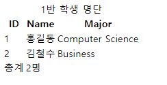

# WEB05

**Table**

- table 의 각 영역을 명시하기 위해 `<thead>`, `<tbody>`,`<tfoot>`  요소를 활용
- `<tr>` 으로 가로 줄을 구성하고 내부는 `<th>` 혹은 `<td>` 로 셀을 구성 
- colsapn , rowspan 속성을 활용하여 셀 병합
- caption 을 통해 표 설명 또는 제목을 나타냄

```html
<body>
  <table>
    <thead>
      <tr>
        <th>ID</th>
        <th>Name</th>
        <th>Major</th>
      </tr>
    </thead>
    <tbody>
      <tr>
        <td>1</td>
        <td>홍길동</td>
        <td>Computer Science</td>
      </tr>
      <tr>
        <td>2</td>
        <td>김철수</td>
        <td>Business</td>
      </tr>
    </tbody>
    <tfoot>
      <tr>
        <td>총계</td>
        <td colspan="2">2명</td>
      </tr>
    </tfoot>
    <caption>1반 학생 명단</caption>
  </table>
  
</body>
```




**form**

- `<form>`은 정보를 서버에 제출하기 위해 사용하는 태그 
- 기본속성
  - action : form  을 처리할 서버의 URL(데이터를 보낼 곳)
  - method : form 을 제출할때 사용할 HTTP 메서드 (GET혹은 POST)
  - enctupe : method가 post 인 경우 데이터의 유형
    - application/x-www-form-urlencoded : 기본값
    - multipart/form-data : 파일 전송시 (input type이 file인 경우)

```html
<form action="/search" method="GET">

</form>
```


**input**

- 다양한 타입을 가지는 입력 데이터 유형과 위젯이 제공됨
-  대표적인 속성
  - name : form control에 적용되는 이름 (이름/값 페어로 전송됨)
  - value : form control에 적용되는 값 (이름/값 페어로 전송됨)
  - required, readonly, autofocus, autocomplete, disabled 등

```html
<form action="/search" method="GET">
	<input type="text" name="q">
</form>
```

 **input label**

- label  을 클릭하여 input 자체의 초점을 맞추거나 활성화 시킬 수 있음 
  - 사용자는 선택할 수 있는 영역이 늘어나 웹 / 모바일(터치) 환경에서 편하게 사용할 수 있음
  - label과 input 입력의 관계가 시각적 뿐만 아니라 화면리더기에서도 label을 읽어 쉽게 내용을 확인 할 수 있도록 함

- input 에 id 속성을, 에는 for 속성을 활용하여 상호 연관을 시킴

```html
<label for="agreement">개인정보 수집에 동의합니다.</label>
<input type="checkbox" name="agreement" id="agreement">
```


**form 활용 실습**

```html
<body>
  <h1>Form 활용 실습</h1>
    <form action="">
  <!-- autofocus 및 label 확인 -->
      <div class="input-group">
        <label for="username">아이디</label>
      </div>
      <input type="text" name="username" id="username" autofocus>
      <!-- disabled 및 value 확인 -->
      <div class="input-group">
        <label for="name">이름</label>
      </div>
      <input type="text" name="name" value="홍길동" id="name" disabled>
      <!-- label 확인 -->
      <div class="input-group">
        <label for="agreement">개인정보 수집에 동의합니다.</label>
      </div>
      <input type="checkbox" name="agreement" id="agreement">
      <div class="input-group">
        <label>최종 제출을 확인합니다.</label>
      </div>
      <input type="checkbox">
    </form>
    <input type="submit" value="제출">

</body>
```


**input  유형** - 일반

- 일반적으로 입력을 받기 위하여 제공되며 타입별로 HTML기본 검증 혹은 추가 속성을 활용할 수 있음 
  - text : 일반 텍스트 입력 
  - password : 입력시 값이 보이지 않고 문자를 특수기로(*) 로 표현
  - email : 이메일 형식이 아닌 경우 form 제출 불가
  - number : min, max, step 속성을 활용하여 숫자 범위 설정 가능 
  - file : accept 속성을 활용하여 파일 타입 지정 가능  

**input  유형** - 항목 중 선택 

- 일반적으로 label 태그와 함께 사용하여 선택 항목을 작성함
- 동일 항목에 대하여는 name을 지정하고 선택된 항목에 대한 value를 지정해야 함
  - checkbox : 다중 선택
  - radio : 단일 선택

**input  유형** - 기타 

- 다양한 종류의 input을 위한 picker를 제공
  - color : color picker
  - date : date picker
- hidden input을 활용하여 사용자 입력을 받지 않고 서버에 전송되어야 하는 값을 설정
  - hidden : 사용자에게 보이지 않는 input