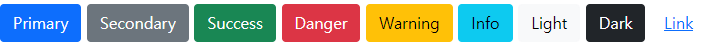
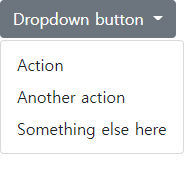
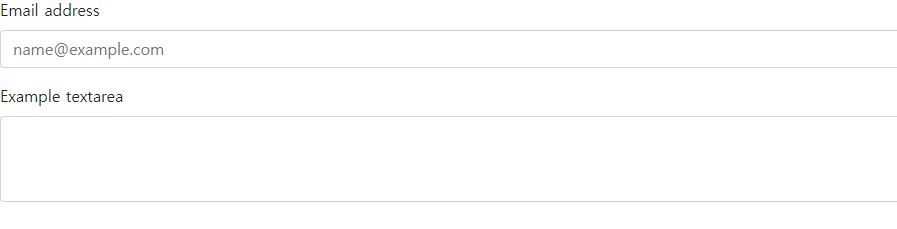
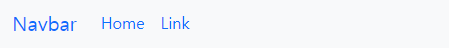
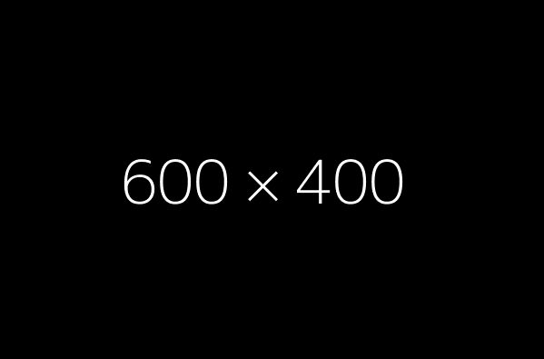

# WEB-06

**Bootstrap Coponent**

다양한 UI 요소를 활용할 수 있음 

Components 탭 및 검색으로 원하는 UI 요소를 찾을 수 있음

기본 제공된 Components를 변환해서 활용


**Button**

- 클릭 했을 때 어떤 동작이 일어나도록 하는 요소

```html
<button type="button" class="btn btn-primary">Primary</button>
<button type="button" class="btn btn-secondary">Secondary</button>
<button type="button" class="btn btn-success">Success</button>
<button type="button" class="btn btn-danger">Danger</button>
<button type="button" class="btn btn-warning">Warning</button>
<button type="button" class="btn btn-info">Info</button>
<button type="button" class="btn btn-light">Light</button>
<button type="button" class="btn btn-dark">Dark</button>
<button type="button" class="btn btn-link">Link</button>
```



**Dropdowns**

- dropdown, dropdown-menu, dropdown-item 클래스를 활용해 옵션 메뉴를 만들 수 있습니다

```html
<div class="dropdown">
    <button class="btn btn-secondary dropdown-toggle" type="button" data-bs-toggle="dropdown" ariaexpanded="false">
    Dropdown button
    </button>
    <ul class="dropdown-menu">
    	<li><a class="dropdown-item" href="#">Action</a></li>
    	<li><a class="dropdown-item" href="#">Another action</a></li>
    	<li><a class="dropdown-item" href="#">Something else here</a></li>
    </ul>
 </div>
```



**Form control**

- form-control 클래스를 사용해  및  태그를 스타일링할 수 있습니다.

```html
<div class="mb-3">
      <label for="exampleFormControlInput1" class="form-label">Email address</label>
      <input type="email" class="form-control" id="exampleFormControlInput1"
      placeholder="name@example.com">
</div>
<div class="mb-3">
      <label for="exampleFormControlTextarea1" class="form-label">Example 		textarea</label>
      <textarea class="form-control" id="exampleFormControlTextarea1" rows="3">				  </textarea>
</div>
```



**Navbar**

- navbar 클래스를 활용하면 네비게이션 바를 제작할 수 있습니다.

```html
<nav class="navbar navbar-expand-lg bg-light">
    <div class="container-fluid">
      <a class="navbar-brand" href="#">Navbar</a>
      <button class="navbar-toggler" type="button" data-bs-toggle="collapse" data-bs-target="#navbarSupportedContent" ariacontrols="navbarSupportedContent" aria-expanded="false" aria-label="Toggle navigation">
        <span class="navbar-toggler-icon"></span>
      </button>
      <div class="collapse navbar-collapse" id="navbarSupportedContent">
        <ul class="navbar-nav me-auto mb-2 mb-lg-0">
          <li class="nav-item">
            <a class="nav-link active" aria-current="page" href="#">Home</a>
          </li>
          <li class="nav-item">
            <a class="nav-link" href="#">Link</a>
          </li>
        </ul>
      </div>
    </div>
  </nav>
```



**Carousel**

- 콘텐츠(사진)을 순환시키기 위한 슬라이드쇼

```html
<div id="carouselExampleSlidesOnly" class="carousel slide" data-bs-ride="carousel">
    <div class="carousel-inner">
      <div class="carousel-item active">
        
      </div>
      <div class="carousel-item">
        
      </div>
      <div class="carousel-item">
        
      </div>
    </div>
  </div>
```

